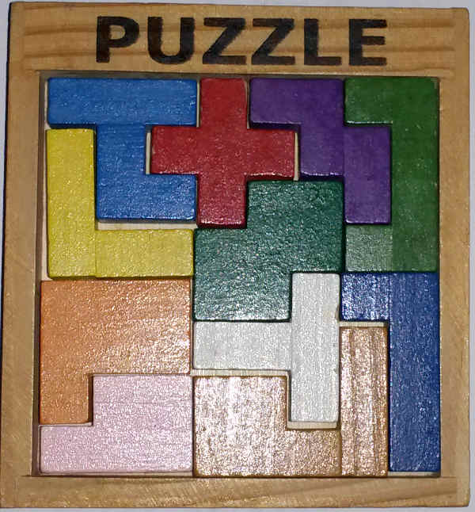

# Cap Puzzle

## Presentation

This program has been designed to find all
solutions of puzzles like the one pictured here:

## Licensing

This program is licensed under the GPLv3,
see [COPYING](COPYING)

## Implementation

A brut force search may take years, for
that reason a more complex algorithm is used
to solve this problem.

The idea behind is first to pre-calculate as
much imformation as possible, like all possible
positions a given piece can have inside the board
(4 rotations, 2 faces, many X and Y offsets).
the class *calque* are here to store, provide and
use this information as efficiently as possible.

The second idea is of course to do
a tree lookup adding a new piece on the board up
to the time no more piece can be added (dead end
branch) or all pieces could take place on the board
(solution). Nothing clever here except maybe the
way to try adding a new piece:

The algorithm here tries to fill the empty places
of the board starting from the edges toward the
center, because it is always more difficult to add
a new piece at the edge when some are already
placed at the edge. Only when all cells of the
edge are filled by a piece, the algorithm considers
filling the next layers of cells toward the center
that would still be empty.

If a cell cannot be filled by any still available
piece in any possible position/rotation/face, we
can prune this branch and step back.
This way, no need to add a lot of piece to find
branches that are dead ends.

## Compilation

Cap_puzzle relies on [libthreadar](https://github.com/Edrusb/libthreadar)
which is used to handle parallelism (multi-threading)
and inter-thread communications and synchronization.
This library is assumed to be installed on the system.

Next, check that the src/Makefile suits your needs (in
particular concerning the optimization options), then:

> cd src

> make

This will produce a binary file called **cap_puzzle**.

## Usage

you need first to setup a configuration file
following this format:

> 
> [dimx, dimy] 
>  
> (x1,y1)[S] 
>  1 0 0 ... 1 
>  0 0 1 ... 0 
>  ... 
>  
> (x2, y2)[T] 
>  0 0 1 ... 
>  .... 
> 

Where **dimx** and **dimy** is the size of the board

**x1** and **y1** is the size of the first piece
followed by a single arbitrary letter between
scare brackets to represent it. Then follows the
description of the shape, as a matrix of
x1 digits per line and y1 lines, where 0 means
empty, 1 means full.

In other words the shape of the piece follows the
place where 1 is set in the (x1, y1) matrix.
In a matrix row, the x1 digits (0 or 1) are
simply separated by spaces

You can add as many piece as necessary to describe
the puzzle

The choice of the **letter** to represent the piece
is arbitrary but two different pieces should not
have the same letter if you want to be able to
read the solutions properly.

Once the configuration is set, you can run the
program giving the configuration file's path as first argument,
followed by the number of thread to run in
concurrency to solve the problem.

At end of execution, the program displays the
solution using the letters given in the
configuration file.

## Example

the configuration file [puzzle.cfg](config/puzzle.cfg) provides
a description of the puzzle pictured in
[puzzle.jpg](doc/puzzle.jpg). The result is produced on stdout is like this [result](results/puzzle.txt)
where you find for each solution a matrix/board filled with the letters associated to each piece.

> cd src  
> ./cap_puzzle ../config/puzzle.cfg 2  

replace "2" by the number of CPU you want to involve
in this resolution for a faster process.

